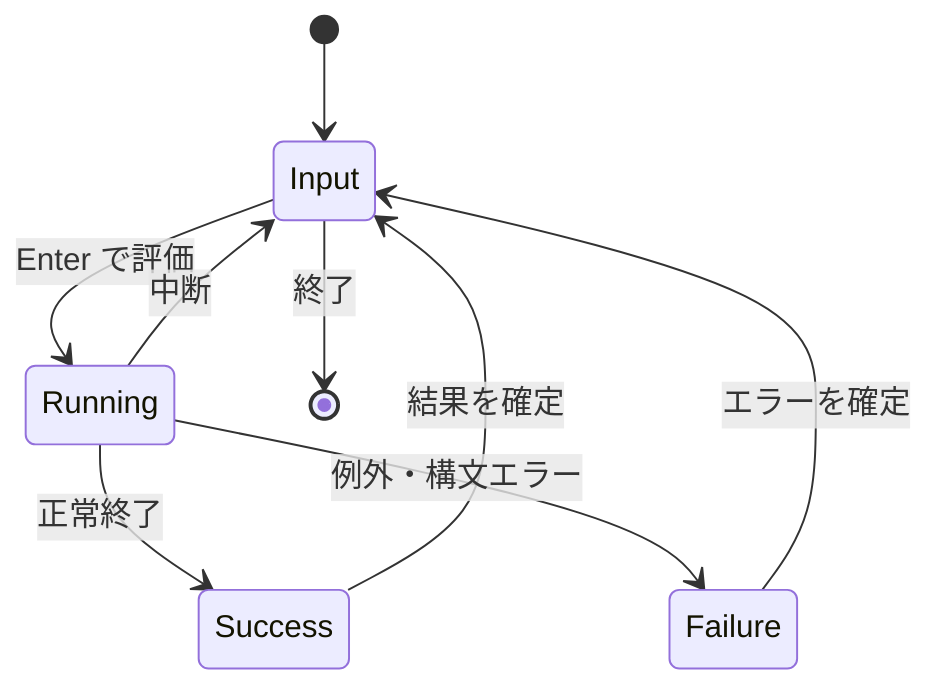

# dopairb 仕様書（草案）

作成日: 2026-09-29  
状態: コンセプト仕様 v0.2

## 1. 概要

**dopairb** は、入力、評価、結果、例外のすべてを派手な演出で返す、ターミナル上の Ruby 対話環境。コードを書く行為そのものを遊びにする。評価結果が読め、履歴やコピー＆ペーストなどの REPL の基本操作も使えることを前提とする。

**実装方針:** IRB を拡張する。Ruby の評価、セッション管理、履歴、補完、例外処理は IRB の機能を使い、dopairb は入力・評価・表示の節目に演出を加える。独立した REPL エンジンは作らない。

「ドーパミン放出系ゲーム」のように、細かな入力フィードバック、期待を高める間、結果に応じた大きな演出を連続させる。スコアはコードの品質評価ではなく、遊びのための数字である。

## 2. 体験の原則

1. **毎キー反応する。** 入力・削除・カーソル移動に小さな視覚フィードバックを付ける。通常のタイプ速度を妨げない。
2. **意味のある節目は一段強く。** 括弧を閉じる、補完を確定する、複数行を完成する、といった瞬間を拾う。
3. **Enter は見せ場の起点。** 評価の開始、待機、成功、失敗を一続きの演出にする。
4. **結果とエラーを読める。** アニメーション終了後には、コピーできる通常のテキストを残す。長い値や例外も省略・装飾だけで失わない。
5. **演出は操作をブロックしない。** 次の入力に入れば演出を即座に収束させる。評価そのものを不必要に遅らせない。
6. **派手さを選べる。** 初期設定は賑やかにしつつ、音、点滅、動き、速度を個別に調整できる。

## 3. 画面構成

通常のプロンプトと出力に、演出用の一時的な領域を加える。

```text
?─ DOPA IRB ─────────── COMBO 07  SCORE 12,480 ─?
│                                                 │
│ dopairb> (1..100).sum                           │
│                                                 │
│             ? PERFECT! ?                        │
│                5,050                            │
│             +720 SCORE                          │
│ => 5050                                         │
?─────────────────────────────────────────────────?
```

これは画面イメージであり、枠の常時表示は必須ではない。狭い端末ではプロンプトと結果を優先し、HUD や装飾を縮小する。評価値は最後に `=> 5050` のような通常のテキストとして残す。

## 4. 演出イベント

各イベントは「トリガー → 一時的な演出 → 残す情報」で定義する。入力中の演出は評価済みの Ruby コードを変更しない。

### 4.1 入力中

| イベント | 演出案 | 強さ |
| --- | --- | --- |
| 文字キーを押す | カーソル付近に火花、短い残像、チャージゲージ加算 | 小 |
| 連続入力 | タイピングコンボと倍率上昇。入力間隔が空けば自然に終了 | 小 |
| 間を置いて入力再開 | 「CHARGE」から再点火 | 小 |
| Backspace / Delete | 消した文字が砕ける。直後の再入力に「RECOVERY」 | 小 |
| カーソル移動 | 移動方向への短い光跡 | 小 |
| 対応する括弧を閉じる | 括弧の対を発光させ「NICE!」 | 中 |
| 文字列・ブロックを閉じる | 閉じた範囲を短くハイライト | 中 |
| 補完を確定する | 候補が入力行に吸い込まれ「LOCK ON」 | 中 |
| 履歴を呼び出す | 過去の式が巻き戻るように現れる | 中 |
| 複数行を継続する | 行が増えるごとにチャージを一段上げる | 中 |

括弧・文字列・ブロックの判定は、入力エディタが把握できる範囲に限る。誤判定で評価内容を変えたり、入力を止めたりしない。

### 4.2 評価と待機

| イベント | 演出案 | 強さ |
| --- | --- | --- |
| Enter で評価確定 | 入力行が発光し「EXECUTE」。短い溜め | 大 |
| 即時に評価完了 | 溜めを短縮して結果に着弾 | 大 |
| 評価が継続 | 経過時間と穏やかなチャージ表示 | 中 |
| 長時間実行 | 動きの少ない待機表示に移行し、時間を更新 | 小 |
| Ctrl-C などで中断 | チャージが散り「INTERRUPTED」 | 大 |

評価開始演出は処理時間を隠さない。速い評価のために待ち時間を追加する場合は、ごく短い上限を設け、設定で無効化できるようにする。

### 4.3 成功と結果

| 結果・状況 | 演出案 | 残す情報 |
| --- | --- | --- |
| 通常の値 | 値が着地して `=>` が光る | 値の通常表示 |
| `nil` | 空振りと煙 | `=> nil` |
| `true` / `false` | 「YES!」/「NO!」の判定スタンプ | `=> true` / `=> false` |
| 大きな数 | 桁が増えるカウントアップ、倍率と衝撃波 | 正確な数値 |
| 前回の数値より大きい | 「NEW RECORD」 | 正確な数値 |
| 長い String | 長さのカウントアップ、文字が流れ込む | 通常の `inspect` 表示 |
| Array / Hash | 要素数の表示、内容が順に展開 | 通常の `inspect` 表示 |
| 定義操作 | 「NEW ABILITY」などのアンロック風表示 | Ruby の通常の評価結果 |
| 連続成功 | COMBO の更新、色とサイズの段階的変化 | 評価結果 |
| 標準出力が大量 | 「OUTPUT RAIN」と出力行数 | 元の標準出力すべて |

型ごとの演出は見せ方の差であり、`inspect` を演出に置き換えない。`inspect` が例外を出す・極端に長い・遅い場合も、通常の REPL と同等以上に操作を妨げないことを目標とする。「定義操作」の識別は初期版では無理に一般化しない。

### 4.4 エラーと復帰

| イベント | 演出案 | 残す情報 |
| --- | --- | --- |
| 構文エラー | 入力行に亀裂、赤い「SYNTAX BREAK」 | エラー本文と位置 |
| `NameError` | 該当する名前を照らし「UNKNOWN SYMBOL」 | 例外名・メッセージ |
| `NoMethodError` | レシーバとメソッドの接続が切れる | 例外名・メッセージ |
| `TypeError` / `ArgumentError` | 要素が衝突して弾ける | 例外名・メッセージ |
| その他の例外 | 短い赤のフラッシュと「FAILED」 | 例外名・メッセージ・バックトレース |
| 連続エラー | 失敗回数を更新。通常コンボは切れる | 各回のエラー全文 |
| エラー後の次の成功 | 「FIXED!」「COMEBACK!」を大きく表示 | 成功結果 |

失敗演出は派手にするが、例外を笑いものにする文言は避ける。エラー位置、本文、バックトレースは可読な通常テキストとして残し、表示順序を崩さない。

### 4.5 セッション

| イベント | 演出案 |
| --- | --- |
| 起動 | タイトル表示と短いイントロ |
| 初回評価 | 「FIRST HIT」 |
| 評価回数の節目 | 10、100、1000 回などでマイルストーン |
| 無操作 | HUD が冷める、待機モーション |
| 終了 | 評価回数、成功数、例外数、最大コンボ、滞在時間のリザルト画面 |

## 5. COMBO・CHARGE・SCORE

- **CHARGE:** キー入力と入力上の節目で増える。その評価が完了すると消費する。一文字を大量入力するだけで無限に増えないよう上限と逓減を設ける。
- **COMBO:** 連続した評価成功数。例外・構文エラーで終了。`nil`、`false` も正常終了なので継続する。
- **SCORE:** 入力、完了、復帰、連鎖の演出用ポイント。コードの正しさ、難しさ、性能を採点しない。長いコードや巨大出力を過度に優遇しない。
- **COMEBACK:** 直前の評価がエラーで、次の評価が成功した場合に発火する。エラーを直したかどうかを厳密に推論したものではないため、「FIXED!」は演出上の表現として扱う。

## 6. 演出の強度と優先順位

強度は **小（毎キー）→ 中（構文上の節目）→ 大（評価完了）→ 特大（記録・復帰）**。同時に複数発火した場合は大きいイベントを優先し、小さい演出を省略または合成する。キューに積んであとから大量再生しない。

設定の候補:

| 設定 | 内容 |
| --- | --- |
| `intensity` | `off` / `low` / `normal` / `max`。初期値 `max`（v0.3.1 で `normal` から変更） |
| `motion` | アニメーションの有無と長さ |
| `flash` | 全画面フラッシュの有無。初期値は控えめ |
| `sound` | `off` / `bell` / `sfx`。初期値 `sfx`（v0.3.1 で `off` から変更。プレイヤーがなければベル） |
| `hud` | COMBO・CHARGE・SCORE の表示 |
| `duration` | 各演出時間の倍率 |
| `color` | 色数と配色。モノクロでも意味が分かる表示 |

ランタイム中に演出を切り替える操作を用意する。点滅を抑える設定は初回起動から選べるようにする。

## 7. 入出力・互換性の要件

- 評価する Ruby コードと評価順序を変えない。`puts`、警告、例外、評価値を取り違えない。
- Ruby プログラムが標準出力・標準エラーへ直接書いた内容は失わず、原則として発生順に見せる。演出との競合時はプログラムの出力を優先する。
- アニメーション終了後のスクロールバックに、入力行、実際の出力、評価結果または例外をテキストとして残す。コピー、検索、ログ保存ができる。
- 端末幅変更、狭い画面、色なし端末、非対話的な起動では演出を縮退させる。`NO_COLOR` などの一般的な色抑制要求を尊重する。
- 貼り付けは一括入力として扱い、貼り付けた全文字に毎キー演出を再生しない。
- 入力中の連続描画は間引き、文字のエコーとカーソル位置を壊さない。
- ユーザーのコードによる端末制御、別スレッドからの出力、非常に長い表示など、制御できない描画があった場合は装飾を諦めて読める出力に戻す。
- 非対話環境で演出用の制御文字を標準出力へ混ぜない。

### IRB 拡張としての境界

- IRB の評価処理を複製しない。dopairb が追加する状態は主に演出状態（COMBO、CHARGE、SCORE など）に限定する。
- 入力中の毎キー演出は IRB が通常使用する Reline の編集・描画との連携点を利用する。Reline の入力内容、カーソル位置、履歴、補完を dopairb 側で再実装しない。
- 評価開始、正常終了、例外、結果表示は IRB 側の処理段階に合わせて発火させる。フックが足りない箇所は対象の IRB／Reline バージョンで調査し、必要なら上流への拡張点の提案を検討する。
- IRB の `binding.irb` 等から起動したセッションへの対応範囲は別途決める。最初は通常の対話起動を対象とする。
- IRB／Reline の内部実装への依存は一箇所に隔離し、対応するバージョン範囲を明記する。公開された拡張点で可能な部分を優先する。

## 8. 状態遷移



入力中は小演出を随時発火する。成功または失敗の演出中に次の入力が来たら、残りの演出を短縮して `Input` に戻る。評価中にユーザーコードが出力した場合、その出力が見えることを優先する。

## 9. 初期版の範囲

最初に体験の核を確かめる範囲:

1. 毎キーの軽いエフェクト、削除、括弧対応、Enter 演出。
2. 成功・例外・中断の異なる演出と、読みやすい最終テキスト。
3. COMBO と SCORE、エラー後の COMEBACK。
4. ターミナル幅と色数に応じた縮退、貼り付けの抑制、演出オフ。

その後に補完・履歴・型別演出・セッションリザルト・サウンドを追加する。入力中の演出には Reline の行編集との深い連携が要るため、具体的なフックと描画方式は対象バージョンの IRB／Reline を調べてから決める。最初の技術検証では、文字入力のたびに描画しても編集状態や補完を壊さないことを確認する。

## 10. 受け入れ条件

- 普通に式を入力して Enter を押すと、入力中・評価開始・成功結果で異なる強度の演出が見える。
- 構文エラーと実行時例外に失敗演出が出て、例外本文とバックトレースを読める。
- 失敗の直後に成功すると COMEBACK が出る。
- 高速入力・長文貼り付け中にキーを取りこぼさず、入力内容が変化しない。
- 評価結果とプログラムの出力をコピーでき、演出を切れば通常の REPL として使える。
- 狭い端末、色なし端末、リダイレクト先に読めない制御シーケンスを残さない。

## 11. 未決定事項

- 常時 HUD を画面上部に固定するか、プロンプト周辺の一時表示にするか。
- `puts` などの評価途中の出力をどの範囲まで捕捉・装飾するか。
- ~~スコアをセッション内だけにするか、記録を保存するか。~~ → 生涯 XP・レベル・ベスト記録・連続日数・ボーナス絵を `~/.local/state/dopairb/profile.json` に保存する（`DOPAIRB_PROFILE=off` で無効）。
- 演出素材を Unicode 文字中心にするか、端末によって別の表現を選ぶか。
- gem の起動コマンドと、通常の `irb` や `.irbrc` から有効化する方法。
- IRB／Reline の対象バージョンと、毎キー描画に必要な拡張点。

